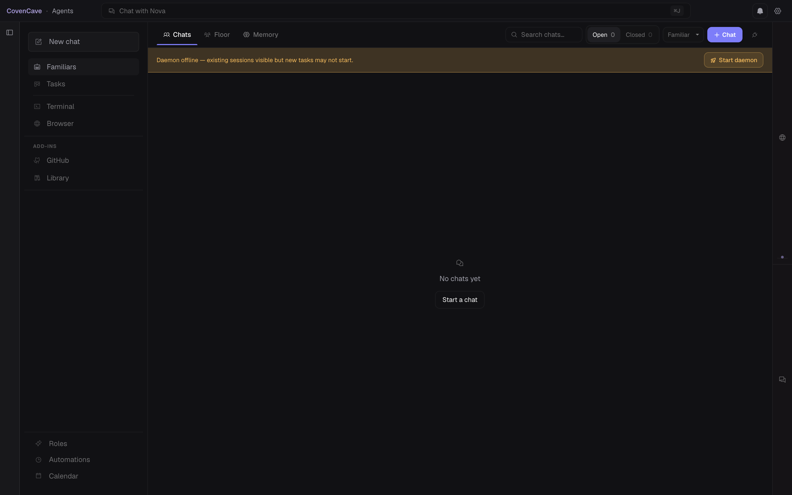
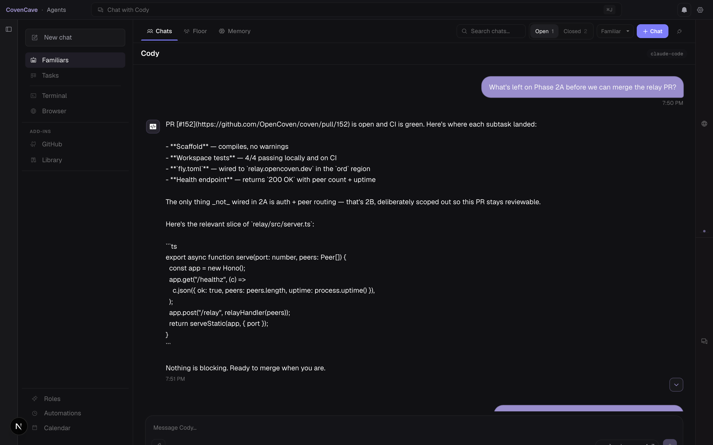
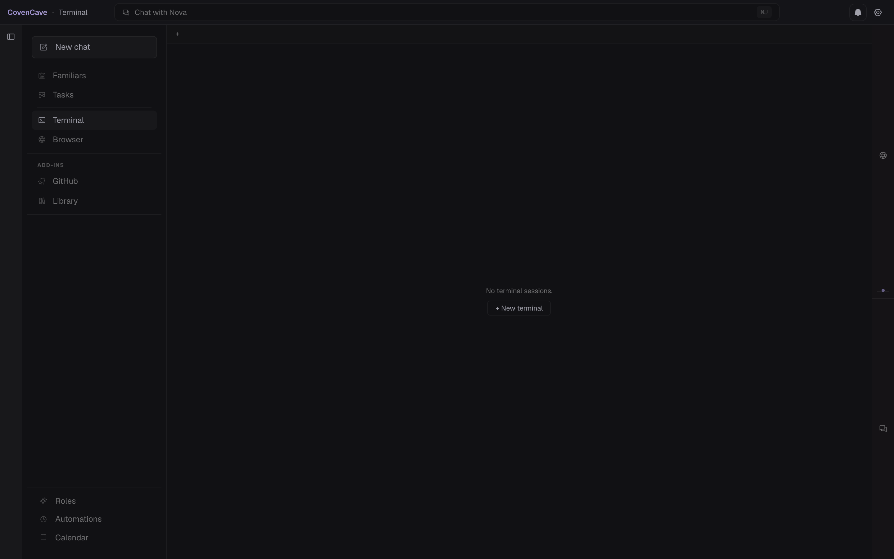

# Cave

> The desktop home for your Coven.

Cave is the native workspace for [OpenCoven](https://github.com/OpenCoven/coven) — a place to talk to your familiars, watch their tools, inspect their memory, and follow the work they're doing across sessions.

A familiar isn't a chat window. It has a name, a purpose, a memory, a toolset, and a place in your day. Cave is where that lives.

## Windows download notice

> [!WARNING]
> **Windows users: turn off Smart App Control before downloading or opening CovenCave for now.**
>
> Go to **Settings -> Privacy & security -> Windows Security -> App & browser control -> Smart App Control**, then turn Smart App Control **Off** before downloading/running the Windows build. Download CovenCave only from the official [GitHub Releases](https://github.com/OpenCoven/coven-cave/releases) page.
>
> This is temporary release guidance while the Windows trust/reputation path settles.

## Install

Download the matching asset from [Releases](https://github.com/OpenCoven/coven-cave/releases):

- **Windows:** download the `.msi`, follow the Smart App Control notice above, then install and launch CovenCave from Start.
- **Linux:** download the `.AppImage`, run `chmod +x CovenCave_*.AppImage`, then launch it from your file manager or terminal.
- **macOS:** download the `.dmg`, open it, and drag CovenCave to Applications.

You'll also need a local runtime source: Codex, Claude Code, Hermes, an existing OpenClaw agent, or another Coven adapter manifest. On first launch, Cave opens a full-width setup screen that checks the `coven` CLI/daemon, creates your local `~/.coven` folder, lets you choose whichever runtime you already have, writes the first familiar binding, creates a Hermes adapter manifest when needed, and starts the daemon.

### First familiar without OpenClaw

OpenClaw is not required to use CovenCave. A fresh Windows user can start with any installed harness:

1. Install CovenCave from the official release asset.
2. Install or expose the `coven` CLI so `coven` works from a new terminal.
3. Install and authenticate at least one runtime:
   - Codex: `npm install -g @openai/codex`, then `codex login`
   - Claude Code: `npm install -g @anthropic-ai/claude-code`, then `claude doctor`
   - Hermes: install Hermes, then make sure `hermes --version` works
   - OpenClaw: keep using an existing agent under `~/.openclaw/agents`
4. Open CovenCave and choose the runtime source that is already healthy on your machine. If you pick Hermes, Cave writes `~/.coven/adapters/hermes.json` so the Coven daemon can launch it through the external adapter path.
5. Name the familiar, click the matching setup button, start the daemon, then open Cave.

The setup screen treats Codex, Claude Code, Hermes, and OpenClaw as peer sources. If setup stalls, click **Copy diagnostics** and include the output with the relevant Cave or Coven sidecar logs.

### Demo mode for testers

Normal installs show only the user's own familiars from their local Coven configuration. Testers can opt into demo fixtures explicitly:

```bash
NEXT_PUBLIC_DEMO=true pnpm dev
```

Use demo mode only for local testing or demos. It intentionally injects sample familiars and sample activity.

## Screenshots

<!-- Cave desktop interface -->





## What it is

- A Tauri 2 desktop app (macOS / Windows / Linux)
- A Next.js 16 frontend (App Router, Turbopack, Tailwind v4)
- Full markdown rendering with syntax highlighting (Shiki)
- Integrated terminal (xterm.js) alongside the familiar interface
- Talks to the local `coven` daemon over `~/.coven/coven.sock`
- Local-first. Your familiars, your memory, your machine.

## What it isn't

- Not a replacement for [CastCodes](https://github.com/OpenCoven/cast-codes) — Cave is its sibling. CastCodes is the terminal and code workspace; Cave is the desktop home for the Coven itself.
- Not a cloud service. There's no upstream to call.

## Features

- **Familiar rail** — persistent sidebar with all your named agents, glyphs, and live health status
- **Chat** — threaded conversations with full markdown, inline code, syntax-highlighted blocks, and copy buttons
- **Inspector pane** — dig into memory, tool calls, and agent internals without leaving the app
- **Board view** — kanban-style overview of active work across familiars
- **Delegation cards** — see what your familiars are doing and hand off tasks
- **Schedules & reminders** — manage cron jobs and one-shot reminders from the UI
- **Plugins** — install skills and plugins directly from the app
- **HomeComposer** — universal intent surface on cold start; describe what you need and let the Coven route it
- **Inbox** — cross-familiar notification feed with snooze and quick-reply
- **System tray** — always accessible, even when the window is closed
- **Cross-platform fatal error dialogs** — startup failures surface clearly on macOS, Windows, and Linux

## Develop

```bash
pnpm install
scripts/install-git-hooks.sh    # one-time: enable secret-scanning pre-commit
pnpm tauri dev                  # native window, hot-reloads Next.js
pnpm dev                        # browser-only at http://localhost:3000
```

You'll need the `coven` daemon running locally so Cave has something to talk to. See [OpenCoven/coven](https://github.com/OpenCoven/coven) for setup. For tester fixtures, run the dev server with `NEXT_PUBLIC_DEMO=true`.

### Pre-commit hook

`scripts/git-hooks/pre-commit` blocks commits that introduce env files,
private keys, signing material, agent scratch state, or inline tokens
(AWS / Stripe / Slack / GitHub PAT / OpenAI / Anthropic / Telegram /
Bearer / PEM private-key blocks). Patterns mirror `src/lib/redact.ts`.
Bypass a confirmed false positive with `git commit --no-verify`.

## Keybinds

| Shortcut       | Action                |
| -------------- | --------------------- |
| `⌘B`           | Toggle familiar rail  |
| `⇧⌘B`          | Toggle inspector pane |
| _drag handles_ | Resize side panels    |

## Stack

| Layer        | Tech                                |
| ------------ | ----------------------------------- |
| Native shell | Tauri 2                             |
| Frontend     | Next.js 16 (App Router, Turbopack)  |
| Styles       | Tailwind v4                         |
| Markdown     | Shiki (syntax highlighting)         |
| Terminal     | xterm.js                            |
| IPC          | Unix socket → `~/.coven/coven.sock` |

## App identity

- **Brand:** Cave
- **macOS app name:** CovenCave
- **Bundle:** `ai.opencoven.cave`
- **Repo:** `OpenCoven/coven-cave`

## Coven ecosystem

- [coven](https://github.com/OpenCoven/coven) — the familiar runtime
- [cast-codes](https://github.com/OpenCoven/cast-codes) — terminal + code workspace
- [coven-docs](https://github.com/OpenCoven/coven-docs) — documentation
- **coven-cave** — desktop home _(you are here)_

## License

Dual-licensed at your option: **AGPL-3.0** ([LICENSE-AGPL](LICENSE-AGPL))
or **MIT** ([LICENSE-MIT](LICENSE-MIT)). See [LICENSE](LICENSE) for the
top-level pointer. Same offer as the rest of the Coven.

---

_The Coven lives in the Cave._

## Release standard

Every release ships with:

- A comprehensive changelog describing features, fixes, and install instructions
- Screenshots updated to reflect the current UI
- SHA256 checksums for all artifacts

See [Releases](https://github.com/OpenCoven/coven-cave/releases) for the full history.
