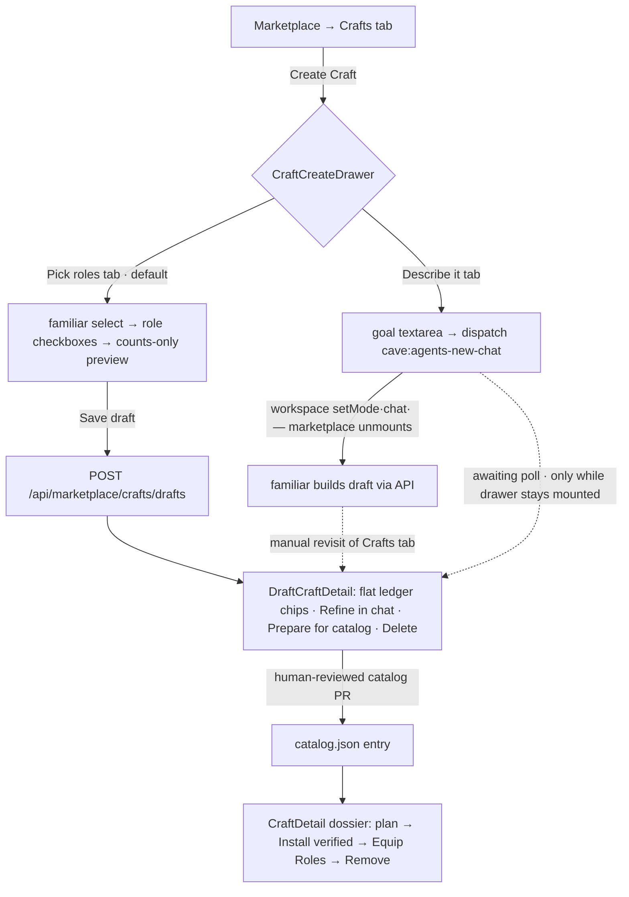
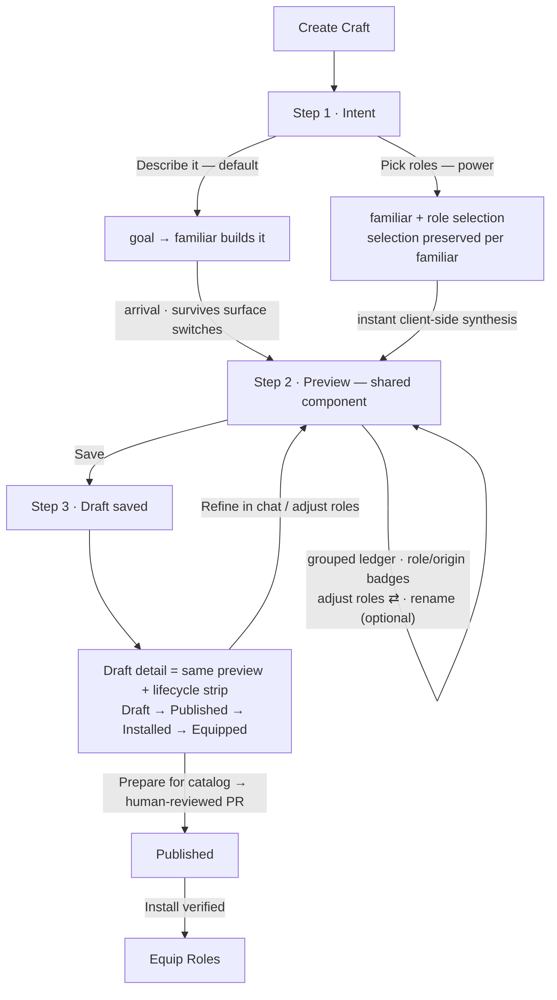

# Craft UX: one seamless authoring flow

Crafts have a strong data model (deterministic extraction with a provenance
ledger, verified transactional installs, human-reviewed publication) wearing a
fragmented UI: two disjoint wizards, a review step that happens *after* commit,
provenance computed then discarded, and an agentic loop that quietly dies the
moment the user follows the chat it opened. This doc is the Checkpoint 1
deliverable of the `craft-ux-simplification` goal: an end-to-end audit of the
shipped flow, a numbered friction inventory grounded in file:line, and the
redesign spec the remaining checkpoints implement.

**Ground rules** (inherited from [`authoring-assist.md`](authoring-assist.md)):
no new architecture, no surface rewrites, no breaking API changes. Publication
stays human-reviewed — nothing here adds a path that writes
`marketplace/catalog.json` directly. Every change reuses a shipped primitive.

**Success condition** (from the goal): a first-time user produces a working
Craft in under two minutes without reading docs; a power user retains full
control — role composition, extraction ledger, draft editing, verification —
without modal maze or dead ends. "Working" means honestly what the trust model
allows: a **plan-verified local draft**, reviewed and one visible action from
each of its futures (refine, publish, equip-after-publish).

---

## The flow today

Two creation modes share a drawer but almost nothing else
(`src/components/marketplace/craft-create-drawer.tsx`):

- **Pick roles** (`extract`, the default tab): choose one familiar, check
  roles, watch a four-number "extraction preview" (counts of components /
  skills / workflows / capabilities), save. The draft is built server-side
  (`buildCraftDraftFromRoles`, `src/lib/craft-draft.ts`) and the drawer hands
  off to the draft detail dialog.
- **Describe it** (`describe`): write a goal, optionally pick a familiar,
  dispatch a chat brief (`buildCraftAgentPrompt`,
  `src/lib/craft-agent-prompt.ts`) carrying the full drafts-API contract. The
  drawer snapshots existing draft ids and polls for a new arrival
  (cave-46wg).

Review happens in **two different dialogs** depending on lifecycle:
`DraftCraftDetail` (`src/components/marketplace/marketplace-detail.tsx:140`)
for local drafts — flat id chips, refine/publish chat briefs, two-step
delete — and the `CraftDetail` dossier
(`src/components/marketplace/craft-detail.tsx`) for published Crafts — install
plan, provenance, equip-roles grid.

## What already works — keep it

- **Deterministic extraction with a provenance ledger.** Every bundled item
  records the roles it came from and its origins (Direct vs `via <craft>`)
  (`craft-draft.ts:162–192`). Unit-tested, pure, importable on the client.
- **The trust boundaries.** Mutating routes are local-origin gated and
  body-capped (pinned by `crafts-routes.test.ts`); installs are transactional
  with rollback and affected-role diagnostics; publication is a human-reviewed
  PR. None of this moves.
- **The chat-brief pattern (P3).** Briefs carry the complete API contract so
  any harness can build end-to-end. The pattern is right; two facts it states
  are wrong (below).
- **Interaction hygiene.** Focus traps + `role="dialog"` on every layer,
  two-step auto-disarming delete, announcer usage, `role="alert"` errors,
  visibility-paused polling.
- **The Crafts-tab intro.** The Familiar → Role → Craft → Capabilities strip
  teaches the composition model in one glance.

## Friction inventory

Ordered by how hard each blocks the success condition. **F1 and F2 are
functional defects**, not polish.

**F1 · Draft plan verification always fails — the briefs promise otherwise.**
All three agent briefs instruct step 4 as
`GET /api/marketplace/crafts/plan?id=<draft id>` → "confirm `ok: true`"
(`craft-agent-prompt.ts:29`, `:76`, `.agents/skills/craft-builder/SKILL.md`
step 4). But plan resolution reads only `marketplace/catalog.json`:
`definitionFor` (`src/lib/server/craft-install.ts:501–513`) →
`loadCraftDefinition` (`src/lib/server/craft-catalog.ts:41–58`). A local
draft id is never there, so every draft plan check returns `unknown_craft`.
The agentic verify step cannot succeed; familiars either report a false
failure or silently skip verification. The same gap means the draft detail
dialog can show no verification state at all.

**F2 · The describe→arrival loop dies on the chat handoff.** The drawer's
arrival polling (`craft-create-drawer.tsx:63–78`) lives in drawer state. The
dispatch it just made (`:200–205`) is handled by the workspace
(`workspace.tsx:1698–1702` → `startFamiliarChat` → `setMode("chat")` at
`:1680`), which unmounts `MarketplaceView` (`:2564–2574`) — drawer, poll, and
baseline snapshot all die. The drawer's own copy invites the user to "watch
the chat", i.e. to take exactly the action that breaks the loop. Arrival only
works for a user who ignores the chat and keeps the drawer open. There is no
Crafts-tab-level in-flight indicator, so a returning user finds the draft
only by manual revisit. ([`authoring-assist.md`](authoring-assist.md) §6
records this loop as closed; the unmount hole is the part the map missed.)

**F3 · Review happens after commit, and the two modes never converge.** Pick-
roles previews only four counts (`craft-create-drawer.tsx:342–350`); the real
ledger is visible only *after* saving, in a different dialog. Describe mode
shows nothing of what will be built. Neither mode has a
preview-before-save step, and each terminates in a different surface.

**F4 · Ledger provenance is computed, then dropped.** `extraction.ledger`
carries `roles[]` + `origins[]` per item, but `DraftCraftDetail` renders flat
id chips from `plugin.craft` (`marketplace-detail.tsx:244–250`) and never
reads `extraction.ledger`. The power user's core question — *why is this in
my bundle?* — is answered in the data model and unanswered on screen.

**F5 · No in-UI draft iteration.** Drafts are create-only + delete-only in
the UI. A one-checkbox adjustment means delete-and-rebuild from scratch, or a
full "Refine in chat" dispatch (recreate-and-replace). The drawer cannot be
reopened seeded from an existing draft, though `extraction.roles` +
`extraction.familiar` contain everything needed.

**F6 · The default tab is the power path.** The drawer opens on `extract`
(`craft-create-drawer.tsx:42`) — a role-checkbox list presuming the user
already understands roles and loadouts. The novice path (describe) is the
second tab. Progressive disclosure, inverted.

**F7 · Dead ends teach nothing.** "No roles found for this familiar"
(`craft-create-drawer.tsx:322`) offers no action — no link to the Roles
section (which lives in the *same hub*, `selectSection("roles")`), no
explanation of what a role is. With zero roles anywhere, describe mode still
dispatches a chat whose failure lands in another surface; the drawer never
warns.

**F8 · A draft's futures are invisible.** Drafts cannot be installed or
equipped (policy `DRAFT`; install would also hit F1's `unknown_craft`). The
detail hints "review … before publishing or installing" but never states the
lifecycle: **draft → human-reviewed catalog PR → install → equip**. "Prepare
for catalog" sits unexplained next to "Refine in chat"; a first-timer has no
way to know it is the *only* road to equipping.

**F9 · The one-familiar rule is discovered by loss.** Switching familiar
silently clears the role selection (`chooseFamiliar`,
`craft-create-drawer.tsx:146–149`). No copy states the constraint the API
enforces (drafts route scopes roles to one familiar,
`crafts/drafts/route.ts:41–43`).

**F10 · Disabled equip checkboxes carry no inline reason.** In the dossier,
role checkboxes disable until the Craft is installed
(`canAttach = current || checked`, `craft-detail.tsx:360`); the reason lives
only in the far-away footer status.

**F11 · Drafts and published Crafts mix in one grid.** The marketplace API
prepends drafts to the plugin list (`api/marketplace/route.ts:57–58`) and the
Crafts tab renders one flat grid where lifecycle is a card chip. Sorting
interleaves them.

**F12 · No naming control.** Draft id and display name are derived
mechanically from familiar + role names (`craft-draft.ts:159–160`). There is
no rename or description edit anywhere before publication.

---

## The redesign: one flow, progressive depth

One drawer, three steps, both starting points converging on the same preview.
Basic users ride the default rail without ever seeing an advanced control;
power users deepen any step in place — never restart, never switch dialogs.

### Principles applied

- **Progressive disclosure.** Describe-first default; role picking, ledger
  origins, renaming, and briefs are one affordance deeper, never required.
- **Preview before commit.** Extraction is pure and client-importable
  (`buildCraftDraftFromRoles`) — the drawer can show the *real* ledger before
  anything is written. Describe arrivals open the same preview.
- **One mental model.** A single `CraftDraftPreview` component renders the
  grouped ledger with origin badges everywhere a draft appears: drawer step 2
  and draft detail. The counts-only preview and the flat-chip ledger both
  retire.
- **Close every loop honestly.** In-flight describe state persists beyond the
  drawer's lifetime; plan verification works for drafts and reports truthful
  per-component diagnostics.
- **Every dead end teaches.** Zero-roles states link to the Roles section of
  the same hub; disabled controls say why inline; the lifecycle strip shows
  where a draft stands and what comes next.

### Design decisions (recorded)

1. **Describe is the default mode.** The last-used mode is remembered
   (localStorage) so power users land on Pick roles on their second visit.
2. **In-flight describe builds persist in `sessionStorage`**
   (`{ baselineIds, dispatchedAt, goal, familiar }`). The Crafts tab — not
   just the drawer — resumes arrival polling on mount, renders an "in-flight
   build" row, and announces arrival with a jump to the draft. Clearing:
   arrival, explicit "stop waiting", or staleness (>1h). SessionStorage over
   the drafts store keeps speculative UI state out of `~/.coven`.
3. **Draft-aware plan, additive.** `GET /api/marketplace/crafts/plan` falls
   back to the drafts store when the catalog misses. Draft plans resolve
   components against the catalog and return `ok: true` with a
   `draftDiagnostics` array naming unresolvable components (extracted
   local-role references legitimately may not exist as catalog plugins) —
   truthful verification instead of `unknown_craft`. Install/uninstall remain
   catalog-only. Briefs and `craft-builder` SKILL update to interpret
   diagnostics.
4. **Draft editing is recreate-and-replace under an editing UI.** "Adjust
   roles" on a saved draft reopens the drawer at the preview step, seeded from
   `extraction.familiar` + `extraction.roles`; save = `DELETE` + `POST`
   (the store's existing semantics, `craft-drafts.ts:100–115`). No new
   mutation surface.
5. **Optional rename at preview.** A name field defaulting to the derived
   display name; the derived value remains the id/slug source. (No
   description editing yet — publication rewrites it in review anyway.)
6. **Lifecycle strip on draft detail.** Draft → Published → Installed →
   Equipped with the current position lit and one line under the strip:
   "Publishing is a human-reviewed catalog PR — Prepare for catalog drafts it
   with a familiar."
7. **The Crafts grid groups by lifecycle.** "Your drafts" strip above
   published Crafts; presentation-only, same data and sort within groups.

## Checkpoint map

Each checkpoint is one PR from a `.worktrees/<branch>` branch; beads track
them (CP1 = `cave-lepz`).

**CP2 — Unified progressive flow (basic path).** Restructure the drawer into
the stepper (Intent → Preview → Save): describe default + last-used memory
(F6); shared `CraftDraftPreview` (grouped ledger, no origin badges yet)
replacing the counts preview (F3); client-side synthesis for
preview-before-save; draft detail adopts the shared preview; Crafts grid
groups drafts vs published (F11). Update `crafts-marketplace.test.ts` pins.

**CP3 — Power layer in-flow.** Origin badges + per-item role attribution in
the shared preview from `extraction.ledger` (F4); "Adjust roles" round trip
preview ⇄ selection with per-familiar selection retention (F5, F9 partial);
edit-existing-draft seeding from draft detail (F5); optional rename (F12).

**CP4 — Close the describe loop honestly.** Draft-aware plan with
`draftDiagnostics` (F1); brief + SKILL updates to match; sessionStorage
in-flight persistence with Crafts-tab resume, in-flight row, and arrival
announcement (F2); verification state on the draft preview/detail (F8
partial: plan status chip).

**CP5 — Empty states, error recovery, a11y.** Teaching dead ends with links
into the hub's Roles section and a zero-roles warning before describe
dispatch (F7); one-familiar hint under the selector (F9); inline disabled
reasons on equip rows (F10); lifecycle strip on draft detail (F8); error
recovery in place for failed saves/arrivals; announcer + focus audit of the
stepper.

**CP6 — Docs + e2e polish.** `marketplace.md` § Draft Crafts and
`authoring-assist.md` §6 updated to the shipped flow; extend
`tests/marketplace-crafts.spec.ts` to cover the stepper, preview, arrival
resume, and draft-plan verification (daemon-less, `page.route(...)` mocks per
CI rules); final usability pass against the success condition.

**Non-goals.** No direct catalog writes, no draft installs, no
multi-familiar Crafts, no redesign of the published-Craft dossier beyond
F10's inline reasons, no new server state stores.

*Written 2026-07-15 from the shipped code (Checkpoint 1, bead `cave-lepz`).
When this map and the code disagree, the code is right — then update this
map.*
